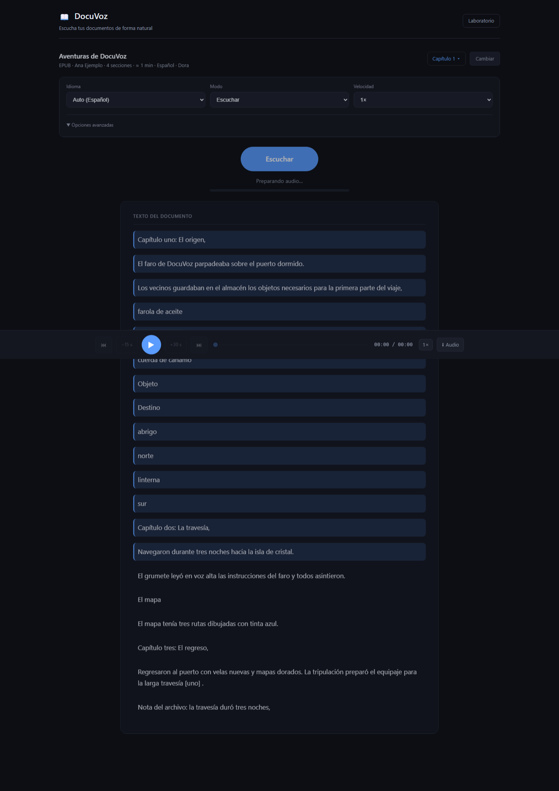

# DocuVoz

**Escucha tus documentos de forma natural.**

DocuVoz is an open-source, audio-first document reader that turns PDF, EPUB,
DOCX, TXT, Markdown and HTML documents into natural, navigable speech while
keeping the spoken audio tied to the source.

<p align="center">
  
</p>

## Why DocuVoz

Most document readers treat text-to-speech as an accessibility button. DocuVoz
is designed around listening:

- **Audio-first playback** — the document is the audio, and the text follows.
- **Deterministic spoken adaptation** — written conventions become easier to
  hear, without inventing content.
- **Source traceability** — every spoken segment is tied back to the source
  document.
- **Structured navigation** — jump by section, follow the current location.
- **Resume** — pick up where you left off, per document.
- **Export** — save the narrated document as audio.
- **Spanish-quality routing** — a better Spanish voice is preferred when
  available.

## Features

- **Formats:** PDF, EPUB, DOCX, TXT, Markdown and HTML, parsed locally.
- **Modes:** _Literal_ (reads source text faithfully) and _Listen_ (deterministic
  spoken adaptation).
- **Speech providers:** Edge TTS (Ximena Spanish routing), NaN/Kokoro, and a
  deterministic local mock — behind a single provider abstraction.
- **Playback:** Play / Pause, −15s / +30s seek, section navigation, speed
  control (0.75×–2×), current-location following.
- **Continuity:** resume position, recent documents.
- **Persistent reopen:** on Chromium, a previously granted file handle can
  reopen the document directly; otherwise it safely falls back to reselecting
  the file.
- **Export:** WAV, MP3 and M4A.
- **Speech quality:** deterministic table/note speech where structural metadata
  exists; local parsing; no TTS network request before Play or Export.

DocuVoz does **not** include M4B, OCR, cloud sync, AI summarization, accounts,
translation, or DRM.

## How it works

```text
Document
   ↓
Local parser
   ↓
CanonicalDocument
   ↓
Literal / Listen
   ↓
Speech planner
   ↓
Edge / NaN / Mock
   ↓
Buffered audio player
   ↓
WAV / MP3 / M4A
```

DocuVoz builds on existing open-source components rather than reimplementing
them: [pdf.js](https://mozilla.github.io/pdf.js/),
[foliate-js](https://github.com/johnfactotum/foliate-js),
[Mammoth](https://github.com/mwilliamson/mammoth.js),
[markdown-it](https://github.com/markdown-it/markdown-it),
[DOMPurify](https://github.com/cure53/DOMPurify),
[fflate](https://github.com/101arrowz/fflate), [idb](https://github.com/jakearchibald/idb)
and [Mediabunny](https://github.com/Vanilagy/mediabunny).

## Listen mode

_Literal_ reads the source text faithfully. _Listen_ deterministically makes
written conventions easier to hear:

- dates
- percentages
- EUR amounts
- legal references
- abbreviations
- structured tables and notes, where available

Listen does **not** summarize, use an LLM, invent content, or intentionally
reorder meaning. If a transformation is uncertain, it falls back to the literal
text.

## Quick start

Requires Node `^24.15.0`. npm is the supported package manager.

```bash
git clone https://github.com/Huntsman1756/docuvoz.git
cd docuvoz
npm ci
cp .env.example .env.local     # works as-is: mock provider, no credentials
npm run dev                    # http://localhost:3000
```

Open <http://localhost:3000>, upload or drag a document, and press **Play**. The
default mock configuration runs without any external credentials.

## Desktop (Tauri, v0.2 beta)

DocuVoz ships an optional desktop build (Windows beta; macOS arm64 via CI):
static frontend + a bundled Node sidecar that reuses the same server speech
runtime. No Node, npm, Git or `.env` file is required on the user machine.

- **Files:** the desktop app opens documents through the OS-native file
  dialog; Rust reads and validates the file (50 MB cap) and the WebView only
  ever receives document bytes. Recent documents store a local path reference
  plus the content fingerprint; reopen verifies the fingerprint before
  restoring a position — a moved/deleted file offers a native "Locate file"
  action instead of silently loading something else.
- **Continuity state** (recents, resume positions, desktop settings) is
  persisted in OS app-data (official Tauri store plugin), not in browser
  storage. The web build keeps its existing localStorage/IndexedDB behavior.
- **Secrets:** the optional NaN API key is stored in the OS credential store
  (Windows Credential Manager / macOS Keychain) via the `keyring` crate —
  never in localStorage, IndexedDB, plaintext files or process arguments, and
  never sent to the WebView. See [docs/decisions/ADR-006-desktop-secrets-keyring.md](docs/decisions/ADR-006-desktop-secrets-keyring.md).
- **Speech on desktop** runs in a loopback-only sidecar (`127.0.0.1`,
  per-process bearer token held by Rust, binary audio frame over IPC). Edge
  TTS wording and fallback semantics above apply unchanged.

Build locally: `npx tauri build` (installer under
`src-tauri/target/release/bundle/nsis/`).

## TTS providers

DocuVoz routes speech through a server-side provider abstraction. The browser
only ever sees an opaque engine id.

- **AUTO** — the server picks the best engine. For Spanish, Edge/Ximena is
  preferred when available. If Edge fails mid-synthesis and a standard engine
  is configured, DocuVoz falls back to it once and shows a small notice; if no
  fallback engine exists, an actionable error is shown. Mock is never silently
  substituted in production.
- **EDGE TTS** — optional, unofficial, best-effort integration with Microsoft
  Edge's online Read Aloud service. No user API key is required. Availability
  is not guaranteed and the service may change or stop working without notice.
  This is not an official Microsoft integration, is not Azure Speech, and
  carries no SLA.
- **NAN** — an optional OpenAI-compatible provider (e.g. Kokoro). Requires
  `NAN_BASE_URL` and `NAN_API_KEY` in the server environment.

Configure providers with environment variables only. Never commit real keys.
See [docs/providers.md](docs/providers.md).

## Privacy

Opening a document:

- parsing happens locally
- no external TTS request is made

Pressing Play / Export:

- spoken chunks may be sent to the selected TTS provider

Recent / resume:

- stored locally

Chromium persistent file handle:

- only with explicit browser permission

DocuVoz is not fully offline when an external speech provider is used. Full
details: [docs/privacy.md](docs/privacy.md).

## Supported formats

| Format   | Parsing                      |
| -------- | ---------------------------- |
| PDF      | pdf.js                       |
| EPUB     | foliate-js / fflate          |
| DOCX     | Mammoth                      |
| TXT      | browser-native               |
| Markdown | markdown-it                  |
| HTML     | DOMPurify + document adapter |

**Known limitation:** scanned PDFs without a text layer are not OCR'd. An
external OCR workflow is required for those.

## Audio export

Export the narrated document as **WAV**, **MP3** or **M4A**, built with
Mediabunny.

> **M4B is not currently supported.**

## Research

DocuVoz originated from research into deterministic spoken representations for
Spanish financial and regulatory documents. The frozen research baseline —
including the Listen engine history, evaluation artifacts, methodology and
historical gates — is preserved separately from the product:

- [docs/phase-0.md](docs/phase-0.md) — research objective, gates and status
- [docs/spoken-representation.md](docs/spoken-representation.md) — the spoken
  representation engine
- [docs/evaluation.md](docs/evaluation.md) and [evaluation/](evaluation/) —
  evaluation artifacts
- [docs/decisions/](docs/decisions/) — architecture decision records

Product evolution continues independently of that frozen research baseline.

## Documentation

- [docs/architecture.md](docs/architecture.md) — architecture
- [docs/privacy.md](docs/privacy.md) — privacy
- [docs/providers.md](docs/providers.md) — speech providers
- [SECURITY.md](SECURITY.md) — security policy
- [CONTRIBUTING.md](CONTRIBUTING.md) — contributing
- [CHANGELOG.md](CHANGELOG.md) — changelog
- [NOTICE.md](NOTICE.md) — notices
- [THIRD_PARTY_NOTICES.md](THIRD_PARTY_NOTICES.md) — third-party notices

## License

Apache-2.0 — see [LICENSE](LICENSE) and [NOTICE.md](NOTICE.md).
